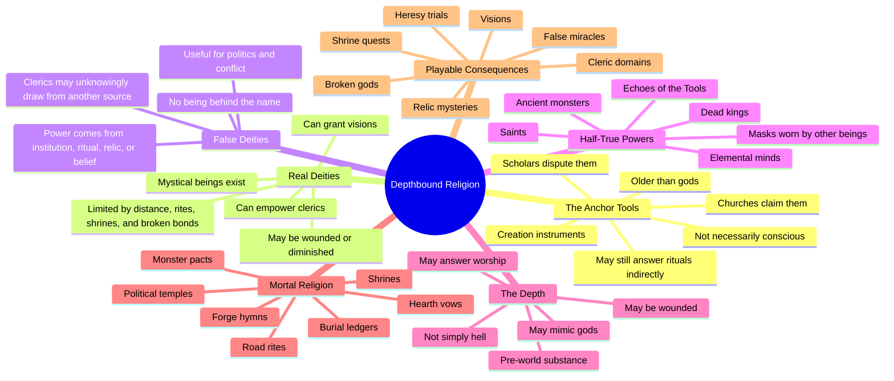

# Depthbound Deity Rework Mindmap

Working purpose: redesign the gods, divine powers, false cults, and creation myth without losing the Anchor Tools myth.

Core new direction:

- The Anchor Tools are older than the gods.
- The Anchor Tools do not need to be people, gods, or conscious beings.
- Some deities are real mystical beings who answer prayers, send visions, empower clerics, or create miracles.
- Some deities are not real at all, even if their churches are powerful.
- Some faiths are wrong, incomplete, or deliberately lying about what they worship.
- Cleric magic can come from real gods, ancient tools, sainted dead, shrine-networks, oaths, cosmic wounds, or something pretending to be divine.

Mindmap
=======

The Creation Myth, Reworked
===========================

Old version:

- The gods raised the world out of the Depth.
- They used five divine tools.
- The gods are cosmic anchor-powers.

New version:

- Before gods, nations, saints, or monsters, there was the Depth.
- The world was not created from nothing. It was lifted, pinned, cut, named, warmed, and bound.
- The first act of creation used the Anchor Tools.
- Later religions say "the gods used the Tools."
- Older traditions say "the Tools made the gods possible."
- Heretical scholars say "the Tools were never held by anyone."
- Some cults say "the Tools are wounds, not relics."

This keeps the myth intact while making it more mysterious.

The Anchor Tools
================

Design rule: each Tool should be metaphysical first, physical second.

They can appear as relics, symbols, dungeon goals, rituals, or myths, but they do
not need to be literal items sitting in a vault.

Possible Anchor Tools:

1. The First Lantern
   - Function: revealed distance, horizon, day, safe sight, and the difference between surface and Depth.
   - Misread by faiths as: a sun god, a saint's lamp, the eye of heaven.
   - Adventure use: undead-cleansing rites, lost beacons, dungeons where light has rules.

2. The Hearth-Nail
   - Function: fixed place, shelter, threshold, village, return, and belonging.
   - Misread by faiths as: a hearth goddess, household saint, ancestral mother.
   - Adventure use: home upgrades, Anchorhold lore, village defense, broken settlements.

3. The Road-Spindle
   - Function: tied one place to another, making roads, trade, pilgrimage, and maps possible.
   - Misread by faiths as: a road god, messenger saint, traveler's patron.
   - Adventure use: shrine-roads, teleport circles, faction routes, lost expeditions.

4. The Name-Ledger
   - Function: made memory, burial, contracts, identity, lineage, and true names stable.
   - Misread by faiths as: death goddess, judge of souls, book of the dead.
   - Adventure use: Gravebinders, undead, oath magic, identity theft, forgotten kings.

5. The Deep Hammer
   - Function: shaped pressure, ore, heat, craft, underworld weight, and the underside of reality.
   - Misread by faiths as: forge god, mountain father, dwarven creator.
   - Adventure use: Embervein, mines, relic crafting, forbidden depth claims.

Optional sixth mystery:

6. The Empty Crown
   - Function: gave command, hierarchy, sovereignty, and the dangerous idea that one will can bind many.
   - Misread by faiths as: king-god, divine monarchy, holy empire.
   - Adventure use: Barrow Crown, dead kings, tyranny, rightful rule, cursed coronations.
   - Important: this might not be a true Anchor Tool. It may be a later corruption.

Divinity Model
==============

Use several kinds of "god" at once.

This makes religion feel layered and lets different cults be wrong in different
ways.

## Type A: True Deity

A real mystical being exists.

They can:

- send visions
- answer prayers sometimes
- empower clerics and paladins
- bless shrines
- curse oathbreakers
- manifest through relics, avatars, dreams, or omens

Limits:

- they are not omnipotent
- they are damaged by the broken world
- they need rites, shrines, names, vows, or mortal action
- they may disagree with their churches

Use for:

- major cleric-supporting gods
- visions
- miracles
- faction patronage

## Type B: Institutional God

No actual deity exists behind the name.

The church is real. The rituals are real. The politics are real. The god is not.

Possible power sources:

- ancient relics
- Anchor Tool echoes
- mass ritual
- saint bones
- stolen divine names
- contracts with hidden beings
- purely mundane authority

Use for:

- corrupt temples
- false prophets
- political religions
- mystery arcs
- clerics who discover their power came from somewhere else

## Type C: Saint, Ascended Mortal, or Dead Power

Something exists, but it is not a god in the usual sense.

Examples:

- sainted heroes
- dead emperors
- ancestral spirits
- martyred clerics
- undead kings
- ancient dragons
- buried titans

Use for:

- local shrines
- regional cults
- class quests
- faction patrons
- morally ambiguous worship

## Type D: Elemental or Primal Power

Not a person, but not inert either.

Examples:

- fire beneath mountains
- storm-minds
- old forests
- sea trenches
- winter-presences
- the memory of stone

Use for:

- druids
- elemental dungeons
- monster pacts
- nature cults
- non-human religions

## Type E: Depth-Mask

Something from the Depth pretends to be divine.

It can:

- answer prayers
- give real powers
- send visions
- resurrect things incorrectly
- mimic dead gods
- tempt desperate clerics

Use for:

- horror
- false miracles
- cults
- late-campaign revelations
- "the god was listening, but not the one you thought"

Pantheon Rework Board
=====================

Current lore has these deity pages:

- Lioran, the Dawn-Bearer
- Maera Hearthwise, Lady of the Threshold
- Hadrin Mile-Saint
- Naevra, Keeper of Names
- Orund Embervein
- Thessa Thorn-Crowned
- Kharovan, the Buried Crown
- The Four Crucible Powers
- The Hollow Below

This board reworks them from "the gods are the Anchor Tools" into a mixed religious landscape.

## Lioran, the Dawn-Bearer

Current role:

- light, dawn, hope, cleansing, undead resistance

Possible new truth:

- Lioran is a real deity, but not the First Lantern itself.
- He may be the first being awakened by the Lantern.
- His church claims he held the Lantern during creation.
- Scholars argue he is only the greatest interpreter of its light.

Reality type:

- Type A: True Deity

Good conflict:

- His priests call darkness evil, but the world was born from the Depth.
- Some of his miracles may be weaker underground.

## Maera Hearthwise, Lady of the Threshold

Current role:

- home, hearth, safety, village, hospitality

Possible new truth:

- Maera may not be a single goddess.
- She could be the combined presence of countless household vows.
- Every true hearth is a tiny shrine, and together they form something divine.

Reality type:

- Type C or Type D: saint-network, hearth-spirit, or living tradition

Good conflict:

- Does Maera exist before mortals make homes, or because mortals make homes?
- Her clerics may be empowered by the Hearth-Nail rather than by a person.

## Hadrin Mile-Saint

Current role:

- roads, travel, mile markers, safe passage

Possible new truth:

- Hadrin was a mortal saint who mapped the first shrine-roads after the Concord.
- He is real as a saintly road-echo, not as a creator god.
- His church exaggerates him into a full deity for political influence.

Reality type:

- Type C: Saint or ascended mortal

Good conflict:

- Road shrines work, but not because Hadrin made roads.
- Bandits and merchants both invoke him.

## Naevra, Keeper of Names

Current role:

- death, burial, names, records, soul-rest

Possible new truth:

- Naevra is real, but she is not death itself.
- She may be the first keeper of the Name-Ledger, or a being created by it.
- The Gravebinders are correct that names matter, but wrong about some afterlife details.

Reality type:

- Type A: True Deity

Good conflict:

- If a name is removed from the Ledger, can Naevra still find the soul?
- Her church may hide terrifying truths about nameless dead.

## Orund Embervein

Current role:

- forge, ore, heat, deep mines, dwarven craft

Possible new truth:

- Orund may be a legendary smith-king whose soul fused with a Deep Hammer echo.
- Dwarves worship him as a god.
- Miners in other cultures treat him as a dangerous depth-saint.

Reality type:

- Type C plus Tool echo

Good conflict:

- He grants real forge miracles, but each miracle may deepen the world's old wound.
- Embervein mines may be holy and forbidden at the same time.

## Thessa Thorn-Crowned

Current role:

- wilderness, monsters, tangled borders, old pacts

Possible new truth:

- Thessa is real, but not civilized divinity.
- She is a crown worn by the wild rather than a person wearing a crown.
- Some monster tribes understand her better than humans do.

Reality type:

- Type D: Primal power

Good conflict:

- Her "blessings" may look like curses to villages.
- She may defend monsters, forests, and old pacts against the player's expansion.

## Kharovan, the Buried Crown

Current role:

- rule, kingship, command, Barrow Crown corruption

Possible new truth:

- Kharovan might not be a god.
- He may be a dead king, a political invention, or the Empty Crown speaking through corpses.
- His church insists he is the patron of rightful rule.
- The Barrow Crown may reveal that "rightful rule" is a trap concept.

Reality type:

- Type B, Type C, or Type E

Good conflict:

- His miracles may be real even if he is false.
- Servants of Kharovan may believe they are clerics, but if Kharovan is false their power comes from the Empty Crown, a relic-pact, or the Depth.

## The Four Crucible Powers

Current role:

- elemental divine powers

Possible new truth:

- They are not gods.
- They are primal procedures by which the world stays physically possible:
  fire changes, water remembers, air carries, earth holds.

Reality type:

- Type D: Elemental or primal powers

Good conflict:

- Elemental clerics are not necessarily priests.
- They may be pact-keepers, geomancers, or living conduits.

## The Hollow Below

Current role:

- divine face of the Depth

Possible new truth:

- The Hollow Below is not a god, but it can behave like one.
- It may answer any prayer sent too deep.
- It may impersonate dead gods, saints, or missing patrons.

Reality type:

- Type E: Depth-Mask

Good conflict:

- A miracle from the Hollow Below can save someone and still be horrifying.
- Some cults are not wrong that it listens.

Open Design Questions
=====================

These are the questions to answer before rewriting the compendium pages.

1. How many fully real gods should exist?

   Good starting answer:
   - 2-4 true gods
   - 2-4 saint/primal powers
   - 1-3 false or disputed gods
   - 1 major Depth-Mask

2. Can false gods still have clerics?

   Good starting answer:
   - No. They are celestial warlocks and may THINK they are clerics with divine powers.

3. Are the Anchor Tools still accessible?

   Good starting answer:
   - Usually no.
   - Their echoes, splinters, imprints, shrines, and corrupted reflections are accessible.

4. Should each player class interpret divinity differently?

   yes but this is more for npcs. no impact on PCs.
   Good starting answer:
   - Clerics: gods, saints, rites, and relics.
   - Paladins: vows, crowns, judgments, holy roads.
   - Druids: primal powers and old pacts.
   - Warlocks: Depth-Masks, saints, monsters, sealed powers.
   - Wizards: Anchor Tools as metaphysical technology.

5. Should the public know some gods are false?

   Good starting answer:
   - No, not usually.
   - Scholars suspect it.
   - Factions exploit it.
   - Players discover it through quests.

Recommended First Canon Pass
============================

This is a strong first version to build from:

True deities:

- Lioran
- Naevra

Saint / ascended / tool-echo powers:

- Hadrin
- Orund
- Maera

Primal powers:

- Thessa
- The Four Crucible Powers

False or disputed deities:

- Kharovan

Depth power:

- The Hollow Below

Anchor Tools:

- Not gods.
- Older than the pantheon.
- Claimed by many religions.
- Still active through relics, rites, geography, and broken world-structures.

Compendium Rewrite Plan
=======================

When this direction feels right, update these lore pages in `Lore/index.html`:

1. Five Great Bonds
   - Change "the gods used divine anchor-tools" to "later faiths claim the gods used them."
   - Introduce the older theory that the Tools predate gods.

2. Gods, Saints, and Divine Powers
   - Reshape the old deity page around reality status and doctrine.
   - Add truth-status categories:
     - Confirmed deity
     - Saint or ascended power
     - Primal power
     - Disputed or false god
     - Depth-Mask

3. Individual god pages
   - Add "Public Doctrine."
   - Add "Hidden Truth."
   - Add "How Clerics Receive Power."
   - Add "Adventure Use."

4. Anchor Tool page
   - Add a dedicated page for the Anchor Tools.
   - Make them creation principles, not personified gods.

5. Barrow Crown page
   - Tie Kharovan and the Empty Crown into the new disputed-god model.

Tone Targets
============

The religion should feel:

- mysterious but usable
- divine but limited
- playable for clerics
- full of local shrines and folk traditions
- suitable for faction conflict
- not cleanly explained by one church
- capable of miracles without proving every doctrine true

Avoid:

- every god being equally real
- every god being equally fake
- the Anchor Tools becoming just another pantheon
- making clerics feel unsupported
- explaining all mysteries too early

Next Work Session
=================

Recommended next step:

1. Pick the final truth-status for each current deity.
2. Rewrite the deity overview page.
3. Rewrite the Anchor Tools page.
4. Rewrite each deity page with public doctrine vs hidden truth.
5. Add cross-links in the Lore compendium.
